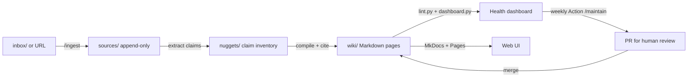

# kms-skills — a self-managing knowledge system

A **compiled knowledge system** ("LLM wiki") in a single Git repo: raw sources
are preserved forever, an LLM compiles them into structured Markdown pages
with provenance, deterministic scripts catch structural rot, scheduled
automation catches semantic rot, and a human approves anything risky.
Architecture based on
[What is an LLM Wiki](https://www.glukhov.org/knowledge-management/knowledge-systems-architectures/compiled-knowledge/what-is-llm-wiki/)
and
[LLM Wiki maintenance & knowledge drift](https://www.glukhov.org/knowledge-management/knowledge-systems-architectures/compiled-knowledge/llm-wiki-maintenance-knowledge-drift/)
(glukhov.org).



## Layout

| Path | What it is | Rules |
|---|---|---|
| `sources/` | Raw material: web snapshots, PDFs, notes, code extracts | Append-only, dated, never edited ([source-policy](policies/source-policy.md)) |
| `nuggets/` | Claim inventory: one YAML per source of atomic claims + context + provenance ("nuggets", richer than chunks) | Claims immutable, supersede to correct ([nugget-policy](policies/nugget-policy.md)) |
| `wiki/` | Compiled knowledge — the actual wiki, also the MkDocs site | Schema frontmatter, citations, supersede-don't-delete ([schema](policies/schema.md)) |
| `inbox/` | Drop zone for material awaiting ingestion | Emptied by `/ingest` |
| `policies/` | The operating rules (schema, citations, sources, review tiers) | High-risk to change |
| `scripts/` | Deterministic checks: `lint.py`, `dashboard.py`, `new_page.py` | No LLM calls |
| `.claude/skills/` | LLM judgment work: ingest, review, contradictions, maintain | Governed by [AGENTS.md](AGENTS.md) |
| `.github/workflows/` | Lint on push, Pages deploy, weekly Claude maintenance | — |

## Daily use (with Claude Code)

```text
/ingest https://example.com/article     # or drop files in inbox/ and run /ingest
/nuggets sources/web/2026-...-foo.md     # extract claim-level nuggets from a source
/review                                  # semantic review of stale pages
/contradictions                          # consistency sweep over the nugget inventory
/maintain                                # the full weekly loop, on demand
```

For manual editing, the repo doubles as an Obsidian vault — see
[the Obsidian guide](wiki/guides/obsidian.md). The maintenance concepts from
the source articles, and where each is implemented in this repo, are traced in
[the maintenance guidelines](wiki/guides/maintenance-guidelines.md).

Without Claude Code, the deterministic layer still works:

```bash
pip install -r requirements.txt
python3 scripts/lint.py            # structural lint (CI runs this on every push)
python3 scripts/dashboard.py       # regenerate wiki/dashboard.md
python3 scripts/new_page.py "Title" --type topic
mkdocs serve                       # browse the wiki at http://127.0.0.1:8000
```

## How it stays honest

Compiled summaries rot in six ways — source, concept, terminology, decision,
citation, and structure drift (see
[the drift page](wiki/topics/knowledge-drift.md) in the wiki itself). The
countermeasures, in order of automation:

1. **Every push** — `lint.py`: frontmatter schema, broken links, orphans,
   missing sources, superseded pages without replacements. CI fails on errors.
2. **Weekly (no LLM)** — the dashboard job recommits
   [`wiki/dashboard.md`](wiki/dashboard.md): pages past their `review_after`
   date, unsourced pages, low-confidence pages, structural issues.
3. **Weekly (Claude)** — a scheduled session runs `/maintain`: fixes low-risk
   findings directly, semantically reviews the most-overdue pages against
   their sources, and opens a PR for anything medium/high-risk. **You review
   the PR** — human approval is the one step that never gets automated.
4. **Always** — Git: every agent change is a reviewable diff with a
   conventional commit message (`ingest:`, `review:`, `lint:`, `dashboard:`),
   and any bad update is a `git revert` away.

## One-time setup after merging to `main`

1. **GitHub Pages**: Settings → Pages → Source: **GitHub Actions**. The site
   deploys on every push to `main`.
2. **Claude weekly maintenance** — two supported mechanisms, run ONE:
   - **claude.ai Routine (current setup)**: a weekly scheduled trigger on
     claude.ai spawns a Claude Code web session that runs the `/maintain`
     loop on `main` and opens PRs. Uses the owner's Claude subscription —
     no repo secrets needed. Manage it from claude.ai (Routines).
   - **GitHub Action (dormant fallback)**: the `claude-maintenance` job in
     `.github/workflows/maintenance.yml` runs only if a secret is added —
     either `CLAUDE_CODE_OAUTH_TOKEN` (from a Pro/Max subscription: run
     `claude setup-token` locally and paste the token, valid ~1 year) or
     `ANTHROPIC_API_KEY` (from [platform.claude.com](https://platform.claude.com),
     separate pay-as-you-go billing; a claude.ai subscription does not include
     API keys). Don't enable both mechanisms — they'd duplicate work.

   The workflow's `dashboard` job needs no secret and runs weekly regardless.
3. **Actions permissions**: Settings → Actions → General → Workflow
   permissions → **Read and write** + **Allow GitHub Actions to create and
   approve pull requests** (needed by the weekly maintenance job).

Without step 2 the weekly `claude-maintenance` job fails (the dashboard job
still runs); without step 3 it can't push fixes or open PRs.

## Extending

- New source types: add a folder under `sources/` and document it in
  [`policies/source-policy.md`](policies/source-policy.md).
- Different review cadences: edit
  [`policies/review-policy.md`](policies/review-policy.md) and the
  `review_interval_days` in page frontmatter.
- The wiki about the wiki: the seed pages under `wiki/topics/` document this
  very architecture — the system is its own first test case.
